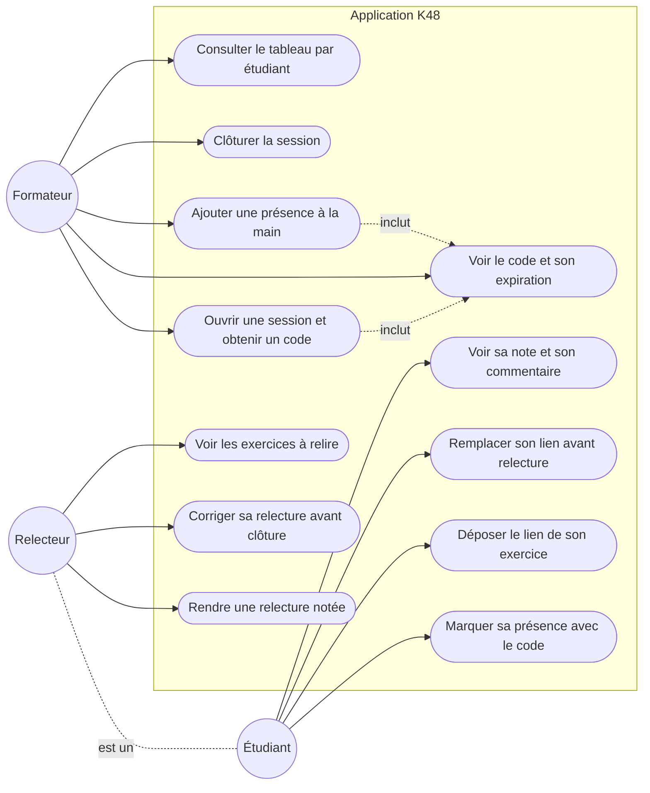

# D1 — Diagramme de cas d'utilisation

> Acteurs : **Formateur** et **Étudiant**. Le relecteur est un étudiant portant ce rôle contextuel (cf. §2 du cahier des charges) — il apparaît comme spécialisation de l'étudiant. Aucune authentification (Q1).

**Références :** EF1–EF16 · RG1 (expiration), RG3 (présence avant clôture), RG4 (source FORMATEUR), RG5 (jamais son propre exercice), RG8 (lien verrouillé après début de relecture), RG10 (correction avant clôture), RG14 (anonymat du relecteur).
