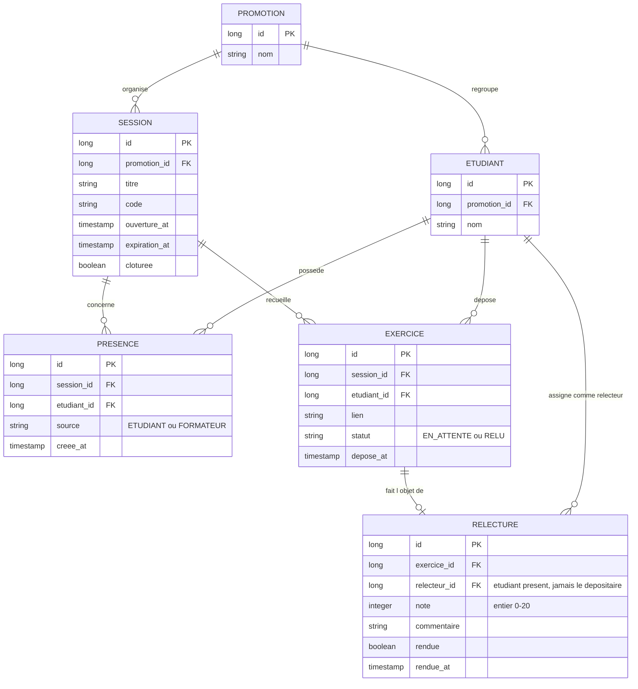

# D2 — Modèle de données

> Ce diagramme doit rester **cohérent avec les migrations Flyway** du backend (`V1__schema_initial.sql`). Une colonne ajoutée ici doit exister dans la migration, et réciproquement.

**Règles portées par ce modèle :**

- `SESSION.code` unique par session, `expiration_at = ouverture_at + 15 min` (RG1).
- `PRESENCE` : unicité `(session_id, etudiant_id)` — contrainte de base (RG2) ; `source` vaut `ETUDIANT` ou `FORMATEUR` (RG4).
- `EXERCICE` : unicité `(session_id, etudiant_id)` (contrat : 409 exercice déjà déposé) ; `statut` : `EN_ATTENTE` → `RELU` (cf. D4).
- `RELECTURE` : une seule par exercice (RG6) — unicité sur `exercice_id` ; `note` entier 0–20 (RG9) ; `rendue=false` = relecture en attente (RG11) ; le relecteur est un étudiant présent à la session et jamais le déposant (RG5, RG7).
- L'anonymat du relecteur (RG14) est garanti par l'API : le DTO renvoyé à l'étudiant relu n'expose jamais `relecteur_id` ni le nom du relecteur.
