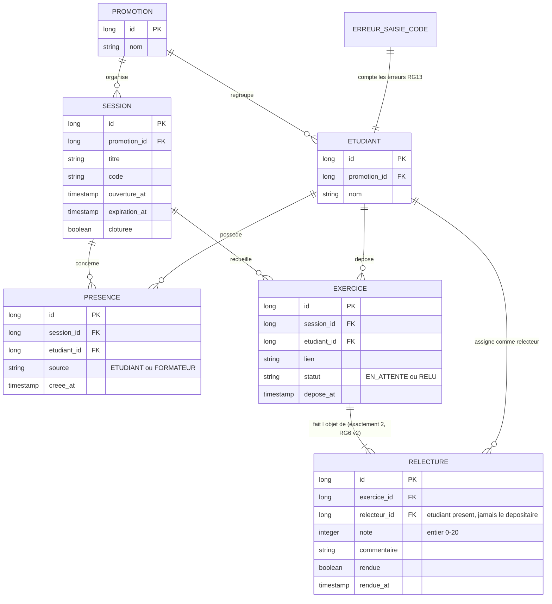

# D2 — Modèle de données

> **Version 2 — enveloppe étape 3 :** un exercice est relu par **deux relecteurs distincts** (RG6 réécrite) ; la relation `EXERCICE–RELECTURE` passe de `||--o|` (0..1) à `||--|{` (exactement 2). Ce diagramme doit rester **cohérent avec les migrations Flyway** (V1, V2, V3 — V3 ajoute la contrainte « au plus deux relecteurs » sans toucher aux migrations existantes ; les données déjà en base survivent).

**Règles portées par ce modèle :**

- `SESSION.code` unique par session, `expiration_at = ouverture_at + 15 min` (RG1).
- `PRESENCE` : unicité `(session_id, etudiant_id)` — contrainte de base (RG2) ; `source` vaut `ETUDIANT` ou `FORMATEUR` (RG4).
- `EXERCICE` : unicité `(session_id, etudiant_id)` (contrat : 409 exercice déjà déposé) ; `statut` : `EN_ATTENTE` → `RELU` (cf. D4).
- `RELECTURE` : **exactement deux par exercice** (RG6 v2 — enveloppe étape 3) — unicité sur `(exercice_id, relecteur_id)` et contrôle « au plus deux relecteurs » ; `note` entier 0–20 (RG9) ; `rendue=false` = relecture en attente (RG11/RG18) ; les relecteurs sont des étudiants présents à la session et jamais le déposant (RG5, RG7).
- L'anonymat du relecteur (RG14) est garanti par l'API : le DTO renvoyé à l'étudiant relu n'expose jamais `relecteur_id` ni le nom du relecteur.
