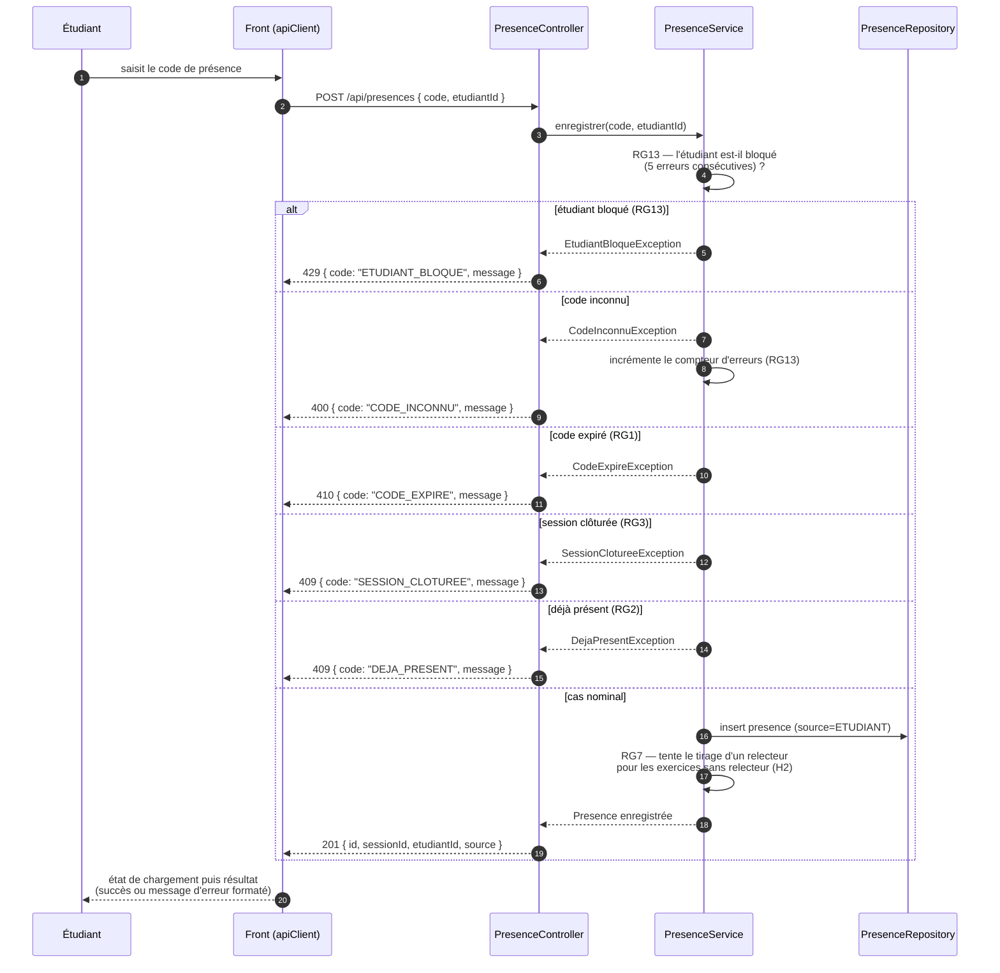

# D3 — Séquence : marquer sa présence

> Cas nominal et cas d'erreur, en cohérence stricte avec le contrat d'API : `400 CODE_INCONNU`, `409 DEJA_PRESENT`, `410 CODE_EXPIRE`, `429 ETUDIANT_BLOQUE` (RG13). Format d'erreur imposé : `{ code, message }`.

**Notes :**

- L'ordre des vérifications est celui du service : blocage RG13 → code inconnu → expiration RG1 → clôture RG3 → unicité RG2. Un code expiré est un code **connu** : la distinction 400/410 est faite par comparaison avec `expirationAt`.
- La session clôturée refuse aussi la présence par code : Q3 (« après la fin de la session : non ») se réalise via la clôture explicite du formateur (RG3).
- En cas de succès, l'enregistrement d'une présence peut débloquer le tirage d'un relecteur pour un exercice déposé avant que quelqu'un d'autre ne soit présent (décision D2/H2 du cahier des charges).
