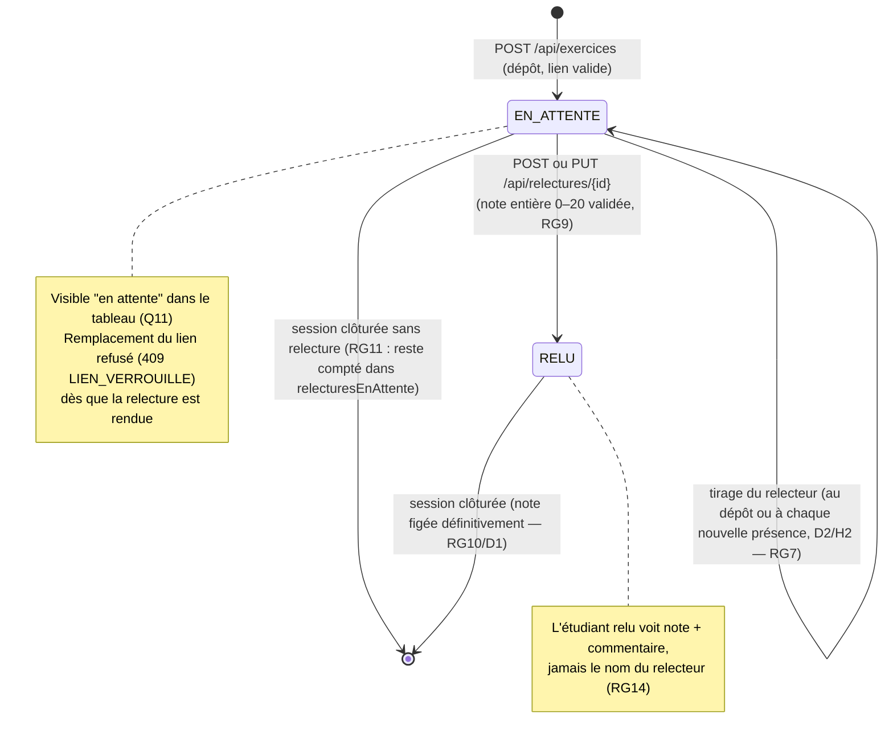

# D4 — États-transitions du cycle de vie d'un exercice (bonus)

> Un exercice naît au dépôt et meurt relu — ou reste en attente si le relecteur ne rend jamais (Q11). Les transitions sont déclenchées par les règles RG6, RG8, RG11 et la décision D2.

**Transitions refusées (et codes associés) :**

| Transition demandée | Condition de refus | Code HTTP / erreur |
|---|---|---|
| Remplacer le lien | Une relecture a été rendue (RG8) | 409 `LIEN_VERROUILLE` |
| Rendre une 2ᵉ relecture | Déjà rendue (RG10/D1) | 409 `RELECTURE_DEJA_RENDUE` |
| Rendre une relecture par le déposant | RG5 | 403 `AUTO_RELECTURE_INTERDITE` |
| Modifier après clôture | RG15 | 409 `SESSION_CLOTUREE` |
| Déposer après clôture | RG12/RG15 | 409 `SESSION_CLOTUREE` |
